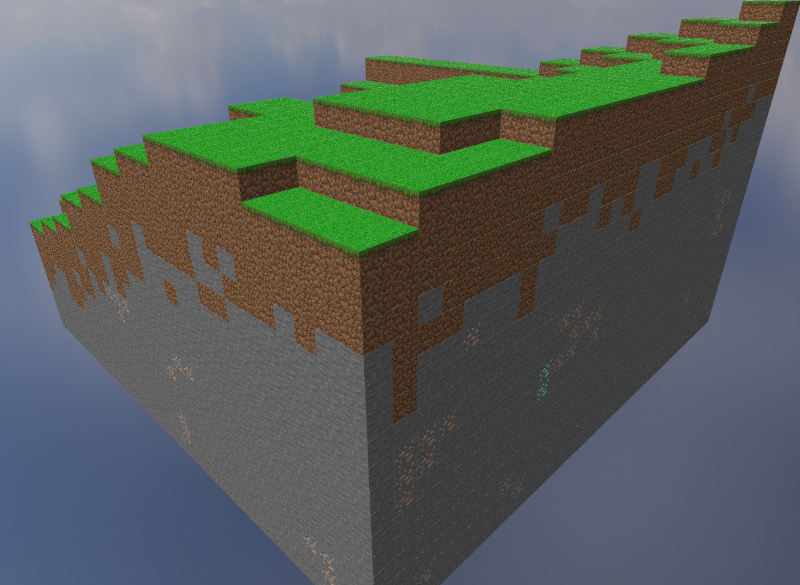
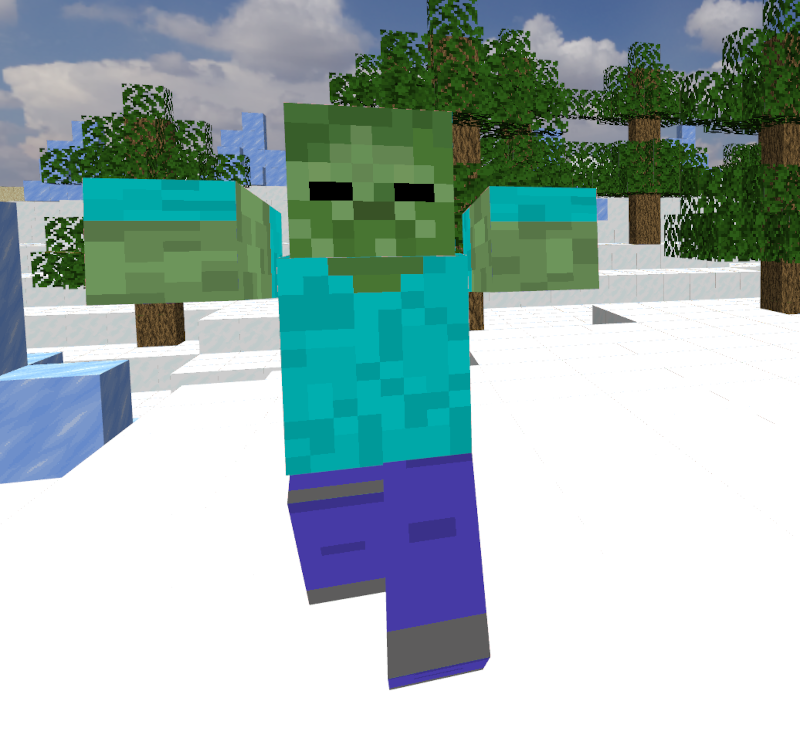
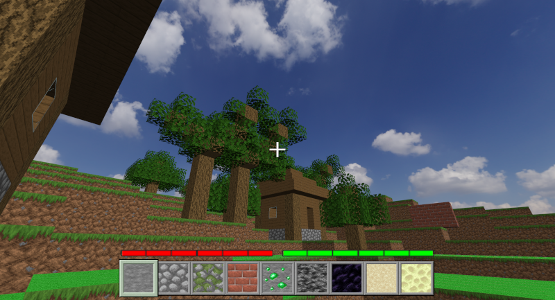
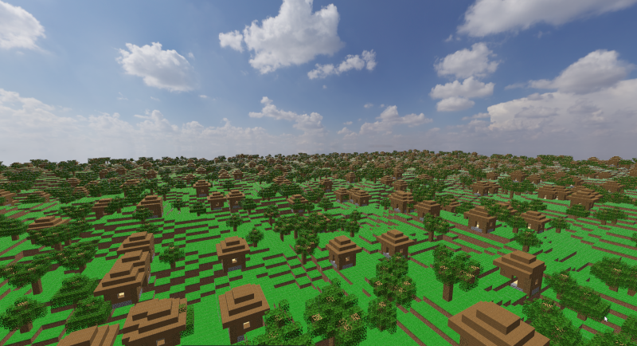
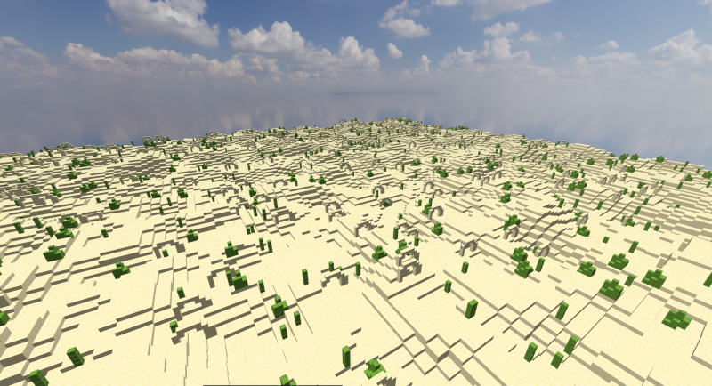
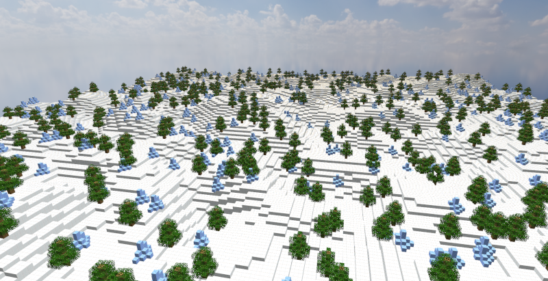

# Projet-Moteur-de-jeux

### Présentation : ###

Ce projet a été réalisé dans le cadre du cours "Moteur de Jeux" du Master Imagine de l'Université de Montpellier. L'objectif était de créer notre propre moteur 3D grâce au langage **C++**, et en particulier avec l'API **OpenGL**. Le bon fonctionnement du moteur est notamment assuré par les bibliothèques suivantes : **GLFW**, **GLAD**, **GLM** et **ImGui**.

Le détail des fonctionnalités présentes dans le moteur se trouve dans le rapport du projet (disponible [ici](Rapport_Projet_Moteur.pdf)).

### Auteurs : ###
+ Brian Delvigne (https://github.com/BraDiZz)
+ Loïc Kerbaul (https://github.com/Loick01)

### Quelques exemples : ###

<p align="center">
  
  <br>
  Génération aléatoire des filons de minerais
</p>

<p align="center">
  
  <br>
  Entité poursuivant le joueur lorsque celui-ci entre dans son rayon de détection
</p>

<p align="center">
  
  <br>
  HUD du joueur, affichant sa jauge de vie (en rouge) et d'endurance (en vert), ainsi que sa barre d'inventaire
</p>
<br>
<br>

+ Trois types de biomes peuvent être générés lors de la création du terrain, avec des structures adaptées à chaque biome.
<p align="center">
  
</p>

<p align="center">
  
</p>

<p align="center">
  
</p>
<br>

### Pour démarrer l'application : ###
L'outil **CMake** est utilisé (via le fichier de configuration *CMakeLists.txt* fourni) afin de facilement pouvoir compiler et exécuter l'application. Pour cela, il suffit de lancer les commandes suivantes dans un terminal ouvert à la racine du projet :
```
mkdir build
cd build
cmake ..
make
./main
```

### Liste des commandes :

+ 'Z', 'Q', 'S', 'D' : Déplacer le joueur
+ Clic gauche de la souris : Casser un bloc
+ Clic droit de la souris : Poser un bloc
+ 'f' : Afficher/Retirer la fenêtre ImGui pour le contrôle des paramètres
+ 'Espace' : Faire sauter le joueur 
+ 'Shift' : Faire courir le joueur
+ Molette de la souris : Changer le bloc sélectionné dans la barre d'inventaire
+ '+', '-'  : Naviguer dans la barre d'inventaire pour changer les blocs disponibles
+ 'Échap' : Quitter l'application

Une liste plus détaillée des contrôles est disponible dans le rapport du projet (disponible [ici](Rapport_Projet_Moteur.pdf)).